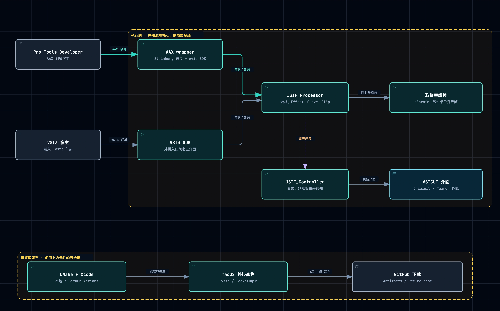
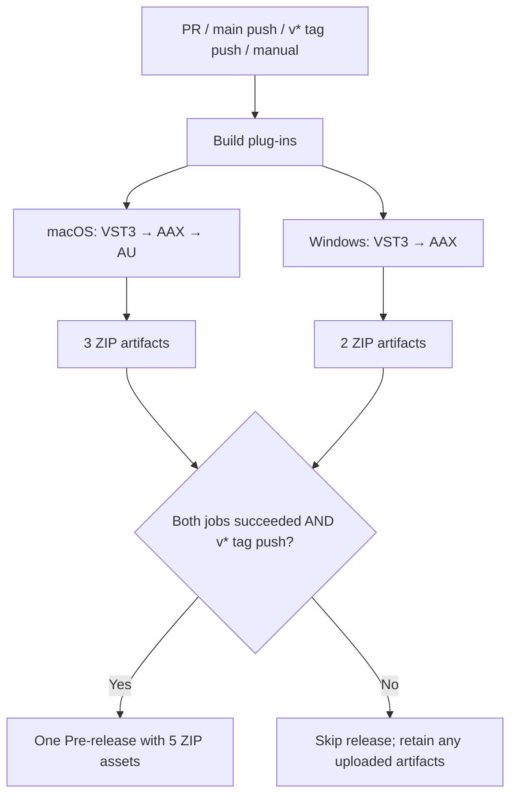

# JS Inflator — Hikari AAX Fork

An audio effect based on [JS Inflator](https://github.com/Kiriki-liszt/JS_Inflator), with AAX integration and macOS/Windows builds. **This AAX adaptation is still in testing.** The AAX downloads require a licensed **Pro Tools Developer** installation; they cannot load in standard Pro Tools because they are not Avid/PACE signed.

[English](README.md) · [繁體中文](README.zh-TW.md) · [Downloads](#downloads) · [Install](#installation) · [Architecture](#architecture) · [GitHub Actions](#github-actions)



<a id="downloads"></a>
## Downloads and platform versions

Current download: **[v2.0.3.2-hikari-beta.2](https://github.com/Hikari-Tsai/JS_Inflator/releases/tag/v2.0.3.2-hikari-beta.2)** — a Pre-release. The plug-in's internal version remains `2.0.3.2`; the Hikari suffix identifies this fork's distribution. [All releases](https://github.com/Hikari-Tsai/JS_Inflator/releases).

| Operating system / CPU | Available formats | Compatibility scope |
|---|---|---|
| macOS, Intel `x86_64` | VST3, AUv2, AAX | Build target: macOS 10.13 or later; the host may require a newer macOS |
| macOS, Apple Silicon `arm64` | VST3, AUv2, AAX | macOS 11 or later; the host may require a newer macOS |
| Windows 10 / 11, `x64` | VST3, AAX | 64-bit hosts; Windows host testing remains pending |

The macOS ZIPs are **Universal**: the same download contains Intel and Apple Silicon binaries. Windows ZIPs contain x64 binaries; there are no native Windows ARM64, 32-bit, or Linux release packages. Build targets are not a claim that every supported OS/host combination has been tested.

| Platform | Format / intended host | Download |
|---|---|---|
| macOS | VST3 — VST3-capable DAWs | [](https://github.com/Hikari-Tsai/JS_Inflator/releases/download/v2.0.3.2-hikari-beta.2/JS_Inflator-macOS-VST3.zip) |
| macOS | AUv2 — Logic Pro, GarageBand and other AU hosts | [](https://github.com/Hikari-Tsai/JS_Inflator/releases/download/v2.0.3.2-hikari-beta.2/JS_Inflator-macOS-AU.zip) |
| macOS | AAX — **Pro Tools Developer only** | [](https://github.com/Hikari-Tsai/JS_Inflator/releases/download/v2.0.3.2-hikari-beta.2/JS_Inflator-macOS-AAX.zip) |
| Windows x64 | VST3 — 64-bit VST3-capable DAWs | [](https://github.com/Hikari-Tsai/JS_Inflator/releases/download/v2.0.3.2-hikari-beta.2/JS_Inflator-Windows-VST3.zip) |
| Windows x64 | AAX — **Pro Tools Developer only** | [](https://github.com/Hikari-Tsai/JS_Inflator/releases/download/v2.0.3.2-hikari-beta.2/JS_Inflator-Windows-AAX.zip) |

Choose the format your host supports; installing all formats is unnecessary. GitHub's automatically generated **Source code** archives are source downloads, not ready-to-use plug-ins. AAX supports Native/AudioSuite targets, not AAX DSP; AudioSuite functionality is not yet verified.

<a id="installation"></a>
## Installation

### macOS

1. Quit your DAW and extract the ZIP for the format you need.
2. In Finder, choose **Go → Go to Folder…** and open the destination below. Copy the entire extracted bundle there; an administrator password may be required.
3. Restart the DAW, rescan plug-ins if necessary, and insert **JS Inflator** on an audio track or bus. AU may appear under manufacturer **yg331**.

| Copy this bundle | Into this folder |
|---|---|
| `JS_Inflator.vst3` | `/Library/Audio/Plug-Ins/VST3/` |
| `JS_Inflator.component` | `/Library/Audio/Plug-Ins/Components/` |
| `JS_Inflator.aaxplugin` | `/Library/Application Support/Avid/Audio/Plug-Ins/` |

The AU download includes its VST3 implementation inside the `.component`; it does **not** need a separately installed VST3. Keep the bundle intact. These macOS builds are ad-hoc signed and not notarized; if macOS blocks loading, record the exact message when reporting the issue. Re-signing cannot provide the PACE authorization needed by standard Pro Tools.

### Windows

1. Quit your DAW and extract the Windows ZIP.
2. Copy the entire `.vst3` or `.aaxplugin` **folder**, including `Contents`, to the destination below. Administrator permission may be required.
3. Restart your 64-bit DAW, rescan plug-ins if necessary, and insert **JS Inflator**. For AAX, launch the licensed Developer edition of Pro Tools.

| Copy this folder | Into this folder |
|---|---|
| `JS_Inflator.vst3` | `C:\Program Files\Common Files\VST3\` |
| `JS_Inflator.aaxplugin` | `C:\Program Files\Common Files\Avid\Audio\Plug-Ins\` |

Do not install only the binary inside `Contents/x86_64-win/` or `Contents/x64/`. These are complete plug-in bundles, not installers, and the Windows binaries are unsigned.

Installation paths follow the [Steinberg VST3 locations](https://steinbergmedia.github.io/vst3_dev_portal/pages/Technical%2BDocumentation/Locations%2BFormat/Plugin%2BLocations.html), [Apple AU locations](https://support.apple.com/en-ie/102239), and [Avid AAX locations](https://learn-cdn.avid.com/AAX_SDK_2p1p1/Documentation/Doxygen/output/html/a00274.html).

### Updating or troubleshooting

Back up the previous plug-in and important sessions before replacing a beta build; verify the replacement in a test session first. To uninstall, quit the host and remove the installed bundle.

- **Not listed in the host:** check the OS/format, install location, complete bundle structure, and host scan results. Standard Pro Tools will reject these unsigned-for-PACE AAX builds.
- **Interface opens but meters do not move:** feed audio into the track/bus and check the host's routing, playback and bypass state. This is an effect, not a sound generator.
- **A control seems inactive:** `Curve` does not change audio at `Effect = 0`; `Phase` does not change audio at `OS = 1x`.

Report issues with the release tag, OS version, CPU, host/version, plug-in format, sample rate and reproduction steps in [Issues](https://github.com/Hikari-Tsai/JS_Inflator/issues).

<a id="architecture"></a>
## Architecture and features

The core uses **C++ + Steinberg VST3 SDK + VSTGUI**. Steinberg's wrappers adapt that core to AUv2 and AAX; r8brain-free-src handles linear-phase resampling. JUCE is only the repository source for the Avid SDK used by CI, not this plug-in's application framework. The diagram's build row illustrates the macOS path; current CI also builds Windows VST3 and AAX.

- Input/output gain, Effect, Curve, Clip, Split and bypass controls.
- 1x, 2x, 4x and 8x oversampling with selectable phase behavior.
- Double-precision internal audio processing and input/output/effect meters.
- Original and Twarch interfaces with skin switching and zoom.

## Testing status

| Scope | Evidence / limitation |
|---|---|
| macOS + Windows build/package checks | [Five-format verification run](https://github.com/Hikari-Tsai/JS_Inflator/actions/runs/35078130661); archive structure and architectures checked |
| macOS AAX controls and interface | Pro Tools Developer 2025.6 on Apple Silicon: controls, meters, skin changes and zoom checked on the documented local build |
| Processor and UI regression tests | 96 audio cases plus meter transport and editor integration checks; see the [test report](tests/results/aax-verification.md) |
| Still pending | Windows host testing, recorded automation, session save/reload, and AudioSuite functional verification |

These are separate checks, not a claim that every release ZIP was manually tested in every host. See [tests/README.md](tests/README.md) for regression-test instructions. AAX remains experimental.

## Building from source

```bash
git clone --recurse-submodules https://github.com/Hikari-Tsai/JS_Inflator.git
cd JS_Inflator
```

Use CMake 3.19 or later and the toolchains/SDK revisions pinned in the [macOS workflow](.github/workflows/macOS%20Build.yml) or [Windows workflow](.github/workflows/Windows%20Build.yml). Those files contain the dependency checkout, configuration, build, verification and packaging commands used for downloads.

| CMake target | Output |
|---|---|
| `JS_Inflator` | VST3 |
| `JS_Inflator-au` | macOS AUv2; requires Xcode, AudioUnitSDK and `SMTG_ENABLE_AUV2_BUILDS=ON` |
| `JS_Inflator-aax` | AAX; requires a valid `SMTG_AAX_SDK_PATH` and VSTGUI |

After configuration, use `cmake --build <build-directory> --config Release --target <target>`. For a distributable local AU, also follow the workflow's VST3 embedding and re-signing steps; the SDK's development symlink alone is not portable. Bundle version changes belong in `CMakeLists.txt`; pushing a differently named Git tag does not update that value.

## GitHub Actions

**Build plug-ins** runs macOS and Windows in parallel and produces five ZIPs. PR updates and pushes to `main` build automatically; a plain `staging` push without a PR does not. Manual builds upload Artifacts only. A new `v*` tag push publishes one **Pre-release** after both platform jobs succeed; it is not marked Latest.

[Actions and build artifacts](https://github.com/Hikari-Tsai/JS_Inflator/actions) · [Release downloads](https://github.com/Hikari-Tsai/JS_Inflator/releases)

<details>
<summary>Full workflow reference: triggers, SDKs, artifacts, release rules, CLI and PR Agent</summary>

### Workflow map

The YAML files in [`.github/workflows`](.github/workflows) are the source of truth. The Actions display name and filename are different in two places:

| Actions display name | Workflow file | Responsibility |
|---|---|---|
| **Build plug-ins** | [Mac Build.yml](.github/workflows/Mac%20Build.yml) | Main entry: run both platforms in parallel, then publish only for a version-tag push |
| **Mac Build** | [macOS Build.yml](.github/workflows/macOS%20Build.yml) | Reusable or manually dispatched macOS build: VST3, AUv2, AAX |
| **Windows Build** | [Windows Build.yml](.github/workflows/Windows%20Build.yml) | Reusable or manually dispatched Windows x64 build: VST3, AAX |
| **PR Agent** | [pr-agent.yml](.github/workflows/pr-agent.yml) | AI-assisted PR description and review; separate from compilation and release jobs |

The main entry keeps its historical filename `Mac Build.yml`; it now builds **both platforms**. Each platform job builds its formats sequentially. The two platform jobs run independently in parallel, subject to runner availability. AU is an Apple format and has no Windows build here.

### What triggers a run?

| Event | Build plug-ins | Release publication | PR Agent workflow |
|---|---|---|---|
| Push a commit to `main` | Both platforms | No | No, unless a separate PR event occurs |
| Push to `staging` or another non-main branch, without a PR | No | No | No |
| Open, reopen, or update an existing PR with new commits | Both platforms | No | Triggered; Bot senders are skipped |
| Change a draft PR to ready for review | Not by this event alone | No | Triggered; Bot senders are skipped |
| Push a tag matching `v*` | Both platforms | Yes, after both succeed | No |
| Manually run **Build plug-ins** | Both platforms | No, even when selecting a tag | No |
| Manually run **Mac Build** / **Windows Build** | Selected platform only | No | No |

There are no path filters or PR target-branch filters: documentation-only PR updates also build, and a PR targeting `staging` can build. For `pull_request`, the build normally checks GitHub's synthetic merge commit, not just the source branch tip; this also explains the SHA in its artifact names. The default PR build activity types are `opened`, `synchronize`, and `reopened`. See [GitHub's event reference](https://docs.github.com/en/actions/reference/workflows-and-actions/events-that-trigger-workflows).

A `staging` push with an open PR can therefore build through the PR event. Merging into `main` starts a new main-branch build. PR Agent success is not a dependency of the release job. No schedule or `issue_comment` trigger is configured.



### Build environments and dependencies

| Platform | Runner | Build tools and configuration | Binary architectures |
|---|---|---|---|
| macOS | `macos-15` | CMake → Xcode 16.2, `Release` | Universal `x86_64` + `arm64` |
| Windows | `windows-2022` | CMake → Visual Studio 17 2022, PowerShell, `Release` | `x64` |
| Release only | `ubuntu-latest` | Download artifacts and run GitHub CLI | No plug-in compilation |

Both builders check out this repository and its recursive submodules, including `r8brain-free-src`. Dependencies are fixed to:

| Dependency | Revision | Use |
|---|---|---|
| Steinberg VST3 SDK | `v3.7.12_build_20` | Both platforms; includes VSTGUI and the AAX/AU wrappers |
| Apple AudioUnitSDK | `e789bc83ddc07cbf80e7bfaf84f1ade975287400` (1.3.0) | macOS AUv2 |
| Avid AAX SDK from the JUCE repository | `72782788ce18c2d4d760b28e0921d6ffc6431102` (SDK 2.9.0) | Both platforms' AAX builds |

AAX checkout is restricted to `modules/juce_audio_plugin_client/AAX/SDK`; the job checks for `LICENSE.txt` and revision constant `20209000`. Only Avid's SDK is used under its GPLv3 option: **JUCE modules are not linked**. No private SDK repository or SDK token is required. AudioUnitSDK 1.3.0 matches the project's existing AU compatibility requirements.

The workflows use `actions/checkout@v4`, `actions/upload-artifact@v4`, and `actions/download-artifact@v4`; macOS also uses `maxim-lobanov/setup-xcode@v1`. These action version tags and runner images can receive upstream updates; pinning the SDK does not make the entire environment byte-for-byte reproducible.

### What each build checks and packages

**macOS:** configure CMake with VSTGUI, AAX and AUv2 enabled; build targets `JS_Inflator`, `JS_Inflator-aax`, and `JS_Inflator-au`. Each format's main binary must contain Intel and Apple Silicon slices, checked with `lipo`. VST3 signing is verified; AAX receives an ad-hoc signature and is verified. AU packaging replaces the SDK's external development symlink at `Contents/Resources/plugin.vst3` with a full copy of the signed VST3 bundle, signs the outer AU, and verifies it with `codesign --verify --deep --strict`. This makes the AU self-contained. `ditto` creates ZIPs while retaining bundle structure and executable permissions.

**Windows:** enable `SMTG_CREATE_BUNDLE_FOR_WINDOWS`, disable installation links, then build `JS_Inflator` and `JS_Inflator-aax`. Packaging requires a real binary at each expected bundle path and checks the DOS header, PE signature, and x64 machine type. PowerShell `Compress-Archive` packages each complete bundle. These Windows builds are unsigned.

The VST3 SDK can also invoke its validator as a post-build step when the validator target is available; consult the build log for that output. The workflows do **not** explicitly run `auval`, the repository's 96-case processor regression suite, Pro Tools GUI tests, session save/reload tests, or AudioSuite functional tests. Earlier local/manual verification is documented separately in the [test report](tests/results/aax-verification.md).

Both platforms' AAX builds require **Pro Tools Developer**. Ad-hoc signing is not Avid/PACE signing, and this pipeline does not perform PACE signing or Apple notarization. A successful CI run establishes the configured build/package checks, not full host compatibility.

### Output locations and downloads

Paths below are relative to the temporary runner checkout. Each named ZIP is created directly inside `build-macos/` or `build-windows/` before upload.

| Format | Runner bundle path | Uploaded ZIP / Release asset |
|---|---|---|
| macOS VST3 | `build-macos/VST3/Release/JS_Inflator.vst3` | `JS_Inflator-macOS-VST3.zip` |
| macOS AUv2 | `build-macos/VST3/Release/JS_Inflator.component` | `JS_Inflator-macOS-AU.zip` |
| macOS AAX | `build-macos/AAXPLUGIN/Release/JS_Inflator.aaxplugin` | `JS_Inflator-macOS-AAX.zip` |
| Windows VST3 | `build-windows/VST3/Release/JS_Inflator.vst3` | `JS_Inflator-Windows-VST3.zip` |
| Windows AAX | `build-windows/AAXPLUGIN/Release/JS_Inflator.aaxplugin` | `JS_Inflator-Windows-AAX.zip` |

Windows binaries are inside `JS_Inflator.vst3/Contents/x86_64-win/JS_Inflator.vst3` and `JS_Inflator.aaxplugin/Contents/x64/JS_Inflator.aaxplugin`. Install the whole bundle, not only the inner binary.

**Artifacts** are files attached to an individual Actions run, named `JS_Inflator-<platform>-<format>-<github.sha>`. They contain the ZIPs above. Open [Actions](https://github.com/Hikari-Tsai/JS_Inflator/actions) → a run → **Artifacts**. Downloading through the GitHub UI requires signing in and repository read access; its download archive may wrap the plug-in ZIP, requiring a second extraction. These workflows do not set `retention-days`, so the repository/organization retention policy applies. See [GitHub's artifact download guide](https://docs.github.com/en/actions/how-tos/manage-workflow-runs/download-workflow-artifacts).

**Release assets** are the same packaged ZIP files copied from that run's Artifacts to a [versioned Release page](https://github.com/Hikari-Tsai/JS_Inflator/releases). Their availability is separate from Actions artifact expiration. Neither mechanism installs the plug-in on your computer. Local and CI builds use the same project sources and targets, but SDK versions, toolchains, flags, signatures and packaging must also match before expecting equivalent results; byte-identical binaries are not guaranteed.

### Release gating and failure behavior

The release job declares `needs: [macos, windows]` and runs only when `github.event_name == 'push'` and `github.ref` starts with `refs/tags/v`. It downloads artifacts from the **same workflow run**, matching `JS_Inflator-*-${{ github.sha }}`, merges them into `dist/`, and checks all five expected ZIPs exist and are non-empty.

It then runs `gh release create` with all five files, `--verify-tag --prerelease --latest=false`, a title based on the tag, and generated notes containing platform/signing information plus source and test-report links at the build SHA. The notes are generated by this workflow, not by PR Agent.

- Any failed or cancelled platform job prevents publication. Earlier successful upload steps may still leave partial Artifacts; inspect both jobs before treating a run as complete.
- Missing upload files fail the upload step. Missing or empty release ZIPs stop the script before `gh release create`.
- A missing tag fails `--verify-tag`. An existing Release with the same tag is not updated or overwritten; the create command fails. If publication fails, inspect the Release page before retrying, since a network/upload failure can leave a partially created Release.
- `plugin-release-${{ github.ref }}` is the release concurrency group. The same tag cannot run two release jobs simultaneously; `cancel-in-progress: false` preserves an already running release job. This is not deduplication or an update mechanism.
- Every matching `v*` tag is currently published as a **Pre-release**, even if its name does not contain `beta`. It is not marked **Latest**, and no stable release is automatically promoted.
- The tag selects a source revision; it does not move `main` or `staging`, nor automatically change the version in `CMakeLists.txt`. The tagged commit must contain the unified workflow and both reusable workflow files.

### Manual builds and version releases

In [Actions](https://github.com/Hikari-Tsai/JS_Inflator/actions), select **Build plug-ins** → **Run workflow** → choose a branch such as `staging`. For one platform, select **Mac Build** or **Windows Build**. Manual dispatch requires the workflow to be present on the default branch; newly introduced workflow files may not appear in the UI until merged there.

Equivalent GitHub CLI commands from this repository, after `gh auth login`:

```bash
# Both platforms; historical filename is intentional.
gh workflow run 'Mac Build.yml' --ref staging

# One platform only.
gh workflow run 'macOS Build.yml' --ref staging
gh workflow run 'Windows Build.yml' --ref staging

# Inspect a run, replacing RUN_ID with its numeric ID.
gh run list --branch staging
gh run view RUN_ID --log-failed
gh run download RUN_ID --dir downloaded-artifacts
```

To publish, first check out the intended release commit and confirm the version tag is unused. This example tags the current `HEAD`; it does not imply that this version has been released:

```bash
git tag -a v2.0.3.2-hikari-beta.3 -m "Hikari beta 3"
git push origin v2.0.3.2-hikari-beta.3
```

Pushing that new tag starts both builds and, if successful, publishes the five ZIPs. Pushing only `staging`, manually building a tag, or rerunning a non-tag build does not publish a Release. For an unpublished tag run with a transient failure, use **Re-run failed jobs** after checking whether a Release already exists. A source/workflow fix requires a new commit and normally a new tag, not merely rerunning an old revision.

### PR Agent, permissions and secrets

PR Agent is independent of `Build plug-ins`. Its workflow subscribes to `opened`, `reopened`, `synchronize`, and `ready_for_review`; a sender with type `Bot` skips the review job. It runs `the-pr-agent/pr-agent@main` on `ubuntu-latest`. One concurrency group per PR (`pr-agent-<number>`) cancels an older in-progress review when a new one starts.

The workflow requests automatic description and review (`auto_describe: true`, `auto_review: true`) and sets `auto_improve: false`. **There is a configuration inconsistency:** [`.pr_agent.toml`](.pr_agent.toml) sets `auto_improve = true`. These are the actual current values, not a guarantee that code suggestions are disabled; consult the resolved `auto_improve` value and execution log for the action version used. The upstream action follows `@main`, so its implementation can change independently of this repository; a triggered workflow does not necessarily mean every review tool ran.

The repository config requests model `gpt-5.5-2026-04-23`, fallback `gpt-5.4-mini`, and Traditional Chinese (`zh-TW`). It asks for up to five findings, persistent review comments, correctness/regression checks, tests/security/effort assessment, real-time audio safety, parameter/state/channel/latency compatibility, and SDK/macOS compatibility. PR description label publication and diagrams are disabled; the original user description is retained. Build directories, `vst3sdk/**`, and `AudioUnitSDK/**` are excluded from review by the configured ignore patterns. See [the upstream automation guide](https://github.com/the-pr-agent/pr-agent/blob/main/docs/docs/usage-guide/automations_and_usage.md) for action behavior.

| Job | Token permissions / secrets |
|---|---|
| Platform builds | Built-in `GITHUB_TOKEN`, `contents: read`; no private SDK secrets |
| Release | Built-in token exposed as `GH_TOKEN`, `contents: write` only on the release job; no extra PAT |
| PR Agent | Built-in `GITHUB_TOKEN`, `contents: read`, `issues: write`, `pull-requests: write`; requires repository secret `OPENAI_KEY` |

Set `OPENAI_KEY` under **Settings → Secrets and variables → Actions**. Build jobs do not use this key. Fork PRs may require Actions approval, do not normally receive repository secrets, and generally have a read-only token; therefore the public-SDK builds can be available while PR Agent cannot authenticate or write its review. A PR Agent failure is not a compilation failure. When diagnosing a red check, open the specific workflow/job and its failing step before rerunning.
</details>

## License and credits

This fork and JS Inflator are licensed under **GNU GPLv3**; see [LICENSE](LICENSE). When distributing binaries or modified versions, retain the required notices and provide the corresponding source and build material under GPLv3. Dependencies keep their own licenses: r8brain-free-src (MIT), VSTGUI (BSD 3-Clause), AudioUnitSDK (Apache 2.0), and the applicable GPLv3/commercial or file-specific terms of the pinned Steinberg and Avid SDKs. SDK licensing, Pro Tools authorization and PACE signing are separate requirements.

Based on [JS Inflator by yg331 / Kiriki-liszt](https://github.com/Kiriki-liszt/JS_Inflator). The alternative interface is by **Twarch**; resampling uses [r8brain-free-src by Aleksey Vaneev](https://github.com/avaneev/r8brain-free-src). This repository maintains the Hikari AAX adaptation and cross-platform build integration.
