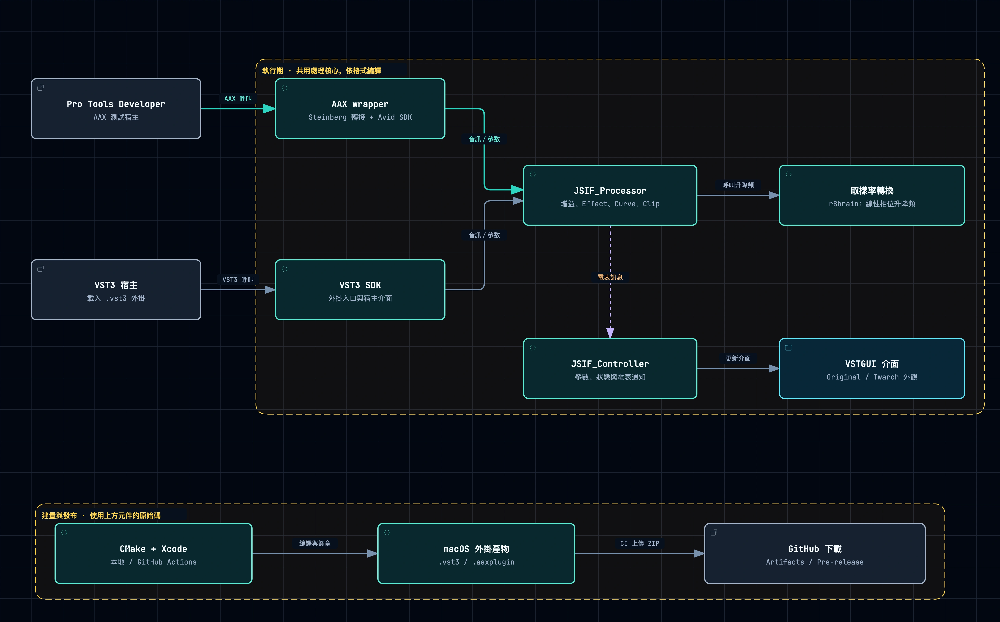
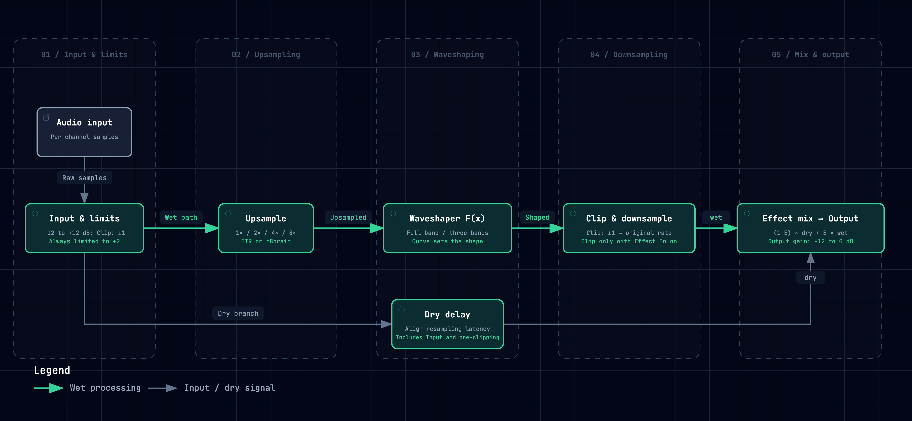

# JS Inflator — Hikari AAX Fork

*Original (left) and Twarch (right) interface skins.*

An audio effect based on [JS Inflator](https://github.com/Kiriki-liszt/JS_Inflator), adding AAX integration, macOS/Windows builds and installers. Built with **C++, Steinberg VST3 SDK and VSTGUI**.

## Download and installation

Current version: [v2.0.3.2-hikari-beta.3](https://github.com/Hikari-Tsai/JS_Inflator/releases/tag/v2.0.3.2-hikari-beta.3) — regular Release / Latest, retaining its original Tag name. AAX, AU and DMG buttons download macOS files; choose the VST3 platform below. Source code archives contain source files.

| Platform | Installer | Plug-in ZIPs |
| --- | --- | --- |
| macOS · Universal Intel / Apple Silicon | [DMG](https://github.com/Hikari-Tsai/JS_Inflator/releases/download/v2.0.3.2-hikari-beta.3/JS_Inflator-macOS.dmg) → `JS_Inflator.pkg` | [AAX](https://github.com/Hikari-Tsai/JS_Inflator/releases/download/v2.0.3.2-hikari-beta.3/JS_Inflator-macOS-AAX.zip), [AU](https://github.com/Hikari-Tsai/JS_Inflator/releases/download/v2.0.3.2-hikari-beta.3/JS_Inflator-macOS-AU.zip), [VST3](https://github.com/Hikari-Tsai/JS_Inflator/releases/download/v2.0.3.2-hikari-beta.3/JS_Inflator-macOS-VST3.zip) |
| Windows 10 / 11 · x64 | Install VST3 ZIP manually | [VST3](https://github.com/Hikari-Tsai/JS_Inflator/releases/download/v2.0.3.2-hikari-beta.3/JS_Inflator-Windows-VST3.zip) |

macOS build targets: Intel 10.13+, Apple Silicon 11+. Hosts may require newer systems; not every OS/host combination has been tested.

1. **Close your DAW.** On macOS, open the PKG inside the DMG. VST3 and AU are selected by default; select AAX under **Customize** if needed.
2. **Windows installation:** extract the ZIP and copy the complete `JS_Inflator.vst3` folder into `C:\Program Files\Common Files\VST3`.
3. **Load:** reopen your DAW, rescan and find **JS Inflator** under audio effects. Use AU in Logic Pro / GarageBand, or VST3 in a VST3-capable host.

**AAX signing:** the macOS AAX inside the ZIP / DMG updated on 2026-09-27 has a **verified PACE signature**, using a local self-signed test certificate rather than Apple Developer ID. It is not notarized; standard Pro Tools loading remains untested. **Unsigned Windows AAX ZIP / EXE downloads have been removed.** beta.1 / beta.2, original beta.3 files and original CI Artifacts are not PACE-signed; existing downloads do not update automatically. See [version status and SHA-256](docs/INSTALLATION.md#aax-signing-status).

**Uninstall:** on macOS, run `Uninstall-JS-Inflator.command` from the DMG, enter `REMOVE` and authorize when prompted. On Windows, remove the manually installed VST3 folder or use the [removal tool for earlier installations](https://github.com/Hikari-Tsai/JS_Inflator/releases/download/v2.0.3.2-hikari-beta.3/JS_Inflator-Windows-Uninstall.zip). Close DAWs first.

See the [installation guide](docs/INSTALLATION.md) for all plug-in paths, previous installers and troubleshooting.

## Architecture and features

Steinberg wrappers adapt the shared DSP core to VST3, AUv2 and AAX. r8brain handles linear-phase resampling. CI obtains only Avid's SDK from the JUCE repository; **the plug-in does not use the JUCE framework**. The architecture diagram shows the macOS build path; CI also supports Windows.

- Input / Output, Effect, Curve, Clip, Band Split and bypass controls.
- 1× / 2× / 4× / 8× oversampling with selectable phase behavior.
- Double-precision audio processing and input / output / effect meters.
- Original and Twarch interfaces with skin switching and zoom.

## Audio algorithm

The path is **input gain and limiting → upsampling → waveshaping → downsampling → dry/wet mix and output**. Curve controls the nonlinear shape; Effect sets the mix. Band Split shapes low, mid and high bands separately. Dry delay compensates for resampling latency.

**Effect = 0% is not full bypass:** Input and pre-clipping still apply. See the [algorithm guide](docs/ALGORITHM.md) for equations, overload behavior and source references.

## Development and GitHub Actions

Use **CMake 3.19+** with the toolchains and SDK revisions pinned in the [macOS](.github/workflows/macOS%20Build.yml) / [Windows](.github/workflows/Windows%20Build.yml) workflows. Targets are `JS_Inflator` (VST3), `JS_Inflator-au` and `JS_Inflator-aax`.

PRs, pushes to `main` and manual dispatch can build; an ordinary `staging` push without a PR does not. A new `v*` Tag publishes a **Pre-release** after both platforms succeed. CI still produces eight test assets with unsigned-for-PACE AAX; the current Release retains six assets after local signing and removal, so it differs from the original Artifacts.

[Build and release guide](docs/DEVELOPMENT.md) · [Actions](https://github.com/Hikari-Tsai/JS_Inflator/actions) · [Test report](tests/results/aax-verification.md)

Recorded checks cover 96 audio regression cases and macOS Pro Tools Developer controls / interface behavior. Windows host testing, recorded automation, session reload and AudioSuite verification remain pending.

## License and credits

Licensed under **[GNU GPLv3](LICENSE)**. Distribution must retain required notices and provide corresponding source and build material. SDKs and libraries retain their own licenses; PACE signing and host authorization are separate requirements.

Original: [yg331 / Kiriki-liszt](https://github.com/Kiriki-liszt/JS_Inflator). Interface: **Twarch**. Resampling: [Aleksey Vaneev / r8brain-free-src](https://github.com/avaneev/r8brain-free-src). **Hikari Tsai** maintains this fork's AAX adaptation and cross-platform builds.
