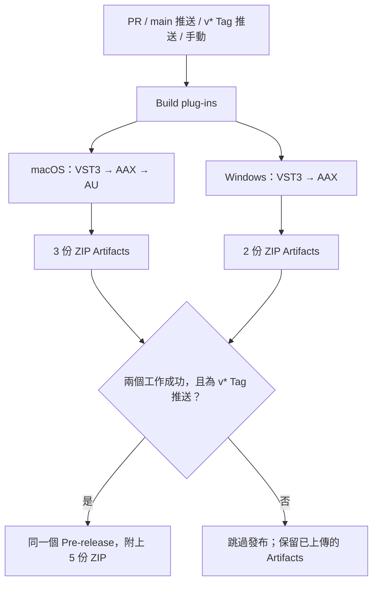

# JS Inflator — AAX 改作版

> **這是 AAX 改作版本，目前尚在測試中。** 本 repository 以 [JS Inflator](https://github.com/Kiriki-liszt/JS_Inflator) 為基礎，針對 AAX 支援與 Pro Tools 整合進行改作，屬於實驗性開發版本，尚非穩定的 AAX 正式版本。目前使用 Pro Tools Developer 測試，尚未完成標準版 Pro Tools 所需的 Avid/PACE 簽章。已驗證項目與尚未涵蓋的測試範圍請見[測試紀錄](tests/results/aax-verification.md)。

[English](README.md) | [繁體中文](README.zh-TW.md)

[GitHub Actions：建置、下載與發布說明](#github-actions)


JS Inflator 是 Sonox Inflator 的仿製版本。  
內部採用雙精度 64 位元處理。  
若宿主支援，也可使用雙精度輸入／輸出。  

以下版本／下載徽章與贊助連結指向上游專案，不代表此改作版已發布 AAX 正式版本。

[](https://github.com/Kiriki-liszt/JS_Inflator/releases/latest)
[](https://tooomm.github.io/github-release-stats/?username=Kiriki-liszt&repository=JS_Inflator)  

[](https://buymeacoffee.com/kirikiaris)


提供兩種 GUI。替代版 GUI 由 Twarch 製作。

### 相容格式

VST3、AUv2、AAX Native／AudioSuite

### 系統需求

Audio Units

* Intel：Mac OS X 10.13 或更新版本
* Apple Silicon：macOS 11.0 或更新版本

VST3

* Intel：Mac OS X 10.13 或更新版本
* Apple Silicon：macOS 11.0 或更新版本
* Windows 10 或更新版本

AAX Native／AudioSuite

* Intel：Mac OS X 10.13 或更新版本
* Apple Silicon：macOS 11.0 或更新版本

### 已測試 DAW

已確認可在 Cubase、Ableton Live、Logic Pro、Cakewalk by Bandlab 與 Bitwig 中運作。

## 使用方式

### Windows

從最新 Release 解壓縮 Windows 版本，並複製到 `C:\Program Files\Common Files\VST3`。

### macOS

從最新 Release 解壓縮 macOS 版本，將 VST3 複製到 `/Library/Audio/Plug-Ins/VST3`，並將 component 複製到 `/Library/Audio/Plug-Ins/Components`。

> 若無法正常運作，可在終端機中為外掛重新簽章：
>
> ```console
> sudo xattr -r -d com.apple.quarantine /Library/Audio/Plug-Ins/VST3/JS_Inflator.vst3
> sudo xattr -r -d com.apple.quarantine /Library/Audio/Plug-Ins/Components/JS_Inflator.component
>
> sudo codesign --force --sign - /Library/Audio/Plug-Ins/VST3/JS_Inflator.vst3
> sudo codesign --force --sign - /Library/Audio/Plug-Ins/Components/JS_Inflator.component
> ```
>
> 由 @jonasborneland 於[此處](https://github.com/Kiriki-liszt/JS_Inflator_to_VST2_VST3/issues/12#issuecomment-1616671177)完成測試。

### 從 v1.x.x 升級至 v2.x.x

刪除舊版本並使用新版本即可。  
任何遵循 Steinberg 標準的 DAW，開啟專案時都會自動替換舊外掛，設定也會自動移轉。

外掛版本變更後，請勿直接開啟既有專案。請先開啟空白專案，讓 DAW 掃描外掛並完成從 v1 到 v2 的更新，再開啟舊專案。

已測試以下升級情境：

1. Cubase 12（Windows），外掛 v1.7.0 -> v2.0.0
2. Cubase 12（macOS），外掛 v1.7.0 -> v2.0.0
3. Cubase 12（Windows），外掛 v1.7.0 -> Cubase 12（macOS），外掛 v2.0.0
4. Logic 10，外掛 v1.7.0 -> v2.0.0
5. Ableton 12（Windows），外掛 v1.7.0 -> v2.0.0
6. Ableton 12（macOS），外掛 v1.7.0 -> v2.0.0
7. Ableton 12（Windows），外掛 v1.7.0 -> Ableton 12（macOS），外掛 v2.0.0

## 授權

JS Inflator 與此改作版本採用 **GNU GPLv3**，詳見 [LICENSE](LICENSE)。可以使用、修改與販售副本。散布修改版或二進位版本時，須保留必要的版權及授權聲明、標明修改，並依 GPLv3 提供完整對應原始碼，包含必要建置資料。私人修改不必公開；使用外掛處理自己的音訊，通常不會使音訊作品受 GPL 約束。詳見 [GNU GPL 官方常見問題](https://www.gnu.org/licenses/gpl-faq.en.html)。

第三方依賴各自保留其授權：

* **r8brain-free-src：** MIT；須保留版權與授權聲明。
* **VSTGUI：** BSD 三條款；須保留聲明及免責條款，並遵守不得擅用作者名義背書的條件。
* **AudioUnitSDK：** Apache 2.0；須保留適用聲明並標明修改。
* **目前建置使用的 VST3 SDK 3.7.12：** Steinberg 商業授權或 GPLv3，另有個別檔案自己的授權。新版已有採用 MIT 的 VST SDK，但更換 SDK 不會解除本專案的 GPL 義務。詳見 [Steinberg 授權說明](https://steinbergmedia.github.io/vst3_dev_portal/pages/FAQ/Licensing.html)。
* **AAX SDK 2.9.0：** 其 `LICENSE.txt` 與原始碼標頭明確提供商業授權或 GPLv3 選項。應遵循所選授權及個別檔案條款，不能一概認定 GPLv3 選項下的 SDK 禁止再散布。本 repository 未附帶 SDK。

AAX SDK 授權、Pro Tools Developer 的使用授權，以及 AAX 二進位簽章是不同事項。取得 Developer 使用授權不等於完成產品發布授權。標準版 Pro Tools 需要經 Avid/PACE 簽章的 AAX；本機 macOS ad-hoc 簽章無法取代它。若要商業化，請依 [Avid 官方 AAX 開發頁面](https://developer.avid.com/aax/) 指示，聯絡 `audiosdk@avid.com` 確認所需工具與授權。SDK 原始碼授權不會自動涵蓋另外提供的 Pro Tools 執行檔或簽章工具。

上述軟體授權不會自動授予超出各權利人授權範圍的第三方商標或美術素材權利。


## 目前建置支援

此 repository 可將相同的音訊處理演算法建置為以下外掛格式：

* VST3
* 透過 Steinberg VST3-to-AUv2 wrapper 建置的 AUv2
* 透過 Steinberg VST3-to-AAX wrapper 建置的 AAX Native 與 AudioSuite

macOS 目標為同時包含 Intel `x86_64` 與 Apple Silicon `arm64` 的 universal binary。所有 macOS 目標的 deployment target 均設為 macOS 10.13。Intel binary 支援 macOS 10.13 或更新版本；Apple Silicon binary 則需要 macOS 11.0 或更新版本。

專案與 bundle 版本為 `2.0.3.2`。AU `AudioComponent` 版本為 `2.0.3`，因為 Apple 的 `0xMMMMmmDD` component version 欄位無法表示第四段版本號。

### 必要工具鏈

目前使用或已驗證的版本：

* CMake 3.19 或更新版本
* Xcode 16.2／AppleClang 16
* VST3 SDK 3.7.12
* VSTGUI 4.14
* AudioUnitSDK 1.3.0，用於相容 macOS 10.13 的 AUv2 建置
* AAX SDK 2.9.0，用於 AAX 建置

AudioUnitSDK 1.4.0 需要 C++23 與 macOS 11.0，因此無法在保留 macOS 10.13 AUv2 相容性的情況下使用。

### macOS 建置

使用必要的 SDK 路徑設定 Xcode build：

```console
cmake -S . -B build -G Xcode \
  -DSMTG_MAC=ON \
  -DGITHUB_ACTIONS=ON \
  -DSMTG_AUDIOUNIT_SDK_PATH=/absolute/path/to/AudioUnitSDK-1.3.0 \
  -DSMTG_AAX_SDK_PATH=/absolute/path/to/aax-sdk-2-9-0 \
  -DSMTG_ENABLE_AUV2_BUILDS=ON \
  -DSMTG_CODE_SIGN_IDENTITY_MAC=- \
  -DSMTG_ENABLE_VST3_PLUGIN_EXAMPLES=OFF \
  -DSMTG_ENABLE_VST3_HOSTING_EXAMPLES=OFF
```

建置各外掛格式：

```console
cmake --build build --config Release --target JS_Inflator
cmake --build build --config Release --target JS_Inflator-au
cmake --build build --config Release --target JS_Inflator-aax
```

只有在 `SMTG_AAX_SDK_PATH` 指向有效 AAX SDK 時，才會產生 AAX target。其他建置細節請參閱 [How_to_build.md](How_to_build.md)。

### 驗證狀態

目前 macOS build 已完成以下驗證：

* VST3 validator：47 項測試通過，0 項失敗
* Apple `auval`：驗證成功
* AAX：已驗證 universal bundle build、必要 AAX／ACF symbols 與 bundle 載入
* Apple Silicon 上的 Pro Tools Developer 2025.6／AAX Native：已實測手動控制、即時電表、換膚及縮放
* Processor 回歸測試：96 項音訊案例通過；單／雙聲道電表傳遞與 editor 尺寸／縮放整合測試通過
* VST3、AUv2 與 AAX 的 Intel `x86_64` Mach-O 最低系統版本均為 macOS 10.13

AAX 版本仍在測試中。本輪尚未驗證主機 automation 錄製、session 儲存／重開，以及 AudioSuite 處理，詳見[測試紀錄](tests/results/aax-verification.md)。未經 Avid/PACE 簽章的 build 需使用 Pro Tools Developer 測試，無法在標準版 Pro Tools 載入。能否再散布取決於適用授權，與此載入限制分開判斷。目前 wrapper target 支援 Native 與 AudioSuite 處理，不支援 AAX DSP。

Windows 與 Linux VST3 build 仍遵循 VST3 SDK 支援的平台與工具鏈。

## GitHub Actions

### Workflow 分工與檔案對照

實際行為以 [`.github/workflows`](.github/workflows) 內的 YAML 為準。Actions 顯示名稱與檔名不完全相同：

| Actions 顯示名稱 | Workflow 檔案 | 負責工作 |
|---|---|---|
| **Build plug-ins** | [Mac Build.yml](.github/workflows/Mac%20Build.yml) | 統一入口：並行呼叫兩個平台，僅在版本 Tag 推送時發布 |
| **Mac Build** | [macOS Build.yml](.github/workflows/macOS%20Build.yml) | 可重用或單獨手動執行的 macOS 建置：VST3、AUv2、AAX |
| **Windows Build** | [Windows Build.yml](.github/workflows/Windows%20Build.yml) | 可重用或單獨手動執行的 Windows x64 建置：VST3、AAX |
| **PR Agent** | [pr-agent.yml](.github/workflows/pr-agent.yml) | AI 輔助 PR 描述與審查，獨立於編譯及發布工作 |

統一入口保留歷史檔名 `Mac Build.yml`，現在會建置**兩個平台**。每個平台內的格式依序編譯，兩個平台工作則獨立並行，實際開始時間取決於 runner 是否可用。AU 是 Apple 平台格式，本專案沒有 Windows AU 建置。

### 什麼情況會觸發？

| 事件 | Build plug-ins | 發布 Release | PR Agent workflow |
|---|---|---|---|
| 推送 commit 至 `main` | 兩個平台 | 否 | 否，除非另有 PR 事件 |
| 推送至 `staging` 或其他非 main 分支，沒有 PR | 不執行 | 否 | 不執行 |
| 開啟、重新開啟 PR，或向既有 PR 推送新 commit | 兩個平台 | 否 | 觸發；Bot 發送者跳過 |
| 將草稿 PR 改為 ready for review | 此事件本身不觸發 | 否 | 觸發；Bot 發送者跳過 |
| 推送符合 `v*` 的 Tag | 兩個平台 | 兩個平台成功後發布 | 不執行 |
| 手動執行 **Build plug-ins** | 兩個平台 | 否，即使選擇 Tag 也不發布 | 不執行 |
| 手動執行 **Mac Build**／**Windows Build** | 僅所選平台 | 否 | 不執行 |

目前沒有路徑篩選或 PR 目標分支篩選，因此只改 README 的 PR 也會建置，目標為 `staging` 的 PR 也適用。`pull_request` 建置通常使用 GitHub 產生的暫時合併 commit，不只是來源分支最後一筆 commit；Artifact 名稱中的 SHA 也對應這個 revision。PR 建置預設事件為 `opened`、`synchronize`、`reopened`，詳見 [GitHub 事件文件](https://docs.github.com/en/actions/reference/workflows-and-actions/events-that-trigger-workflows)。

所以，`staging` 有開啟中的 PR 時，推送可以透過 PR 更新事件觸發建置。合併至 `main` 後，則另起一次 main 分支建置。發布 job 不依賴 PR Agent 成功。目前未設定排程或 `issue_comment` 觸發。



### 建置環境與依賴

| 平台 | Runner | 建置工具與設定 | 二進位架構 |
|---|---|---|---|
| macOS | `macos-15` | CMake → Xcode 16.2，`Release` | Universal `x86_64` + `arm64` |
| Windows | `windows-2022` | CMake → Visual Studio 17 2022，PowerShell，`Release` | `x64` |
| 僅發布工作 | `ubuntu-latest` | 下載 Artifacts，再執行 GitHub CLI | 不編譯外掛 |

兩個平台都會 checkout 本 repository 與 recursive submodules，包括 `r8brain-free-src`。SDK 固定使用：

| 依賴 | Revision | 用途 |
|---|---|---|
| Steinberg VST3 SDK | `v3.7.12_build_20` | 兩個平台；包含 VSTGUI 與 AAX／AU wrapper |
| Apple AudioUnitSDK | `e789bc83ddc07cbf80e7bfaf84f1ade975287400`（1.3.0） | macOS AUv2 |
| JUCE repository 中的 Avid AAX SDK | `72782788ce18c2d4d760b28e0921d6ffc6431102`（SDK 2.9.0） | 兩個平台的 AAX |

AAX 僅 checkout `modules/juce_audio_plugin_client/AAX/SDK`，並檢查 `LICENSE.txt` 與版本常數 `20209000`。使用的是 Avid SDK 的 GPLv3 授權選項，**沒有連結 JUCE 模組**，也不需要私人 SDK repository 或 SDK token。AudioUnitSDK 1.3.0 配合專案既有的 AU 相容性要求。

工作流使用 `actions/checkout@v4`、`actions/upload-artifact@v4`、`actions/download-artifact@v4`；macOS 另使用 `maxim-lobanov/setup-xcode@v1`。這些 Action 版本標籤與 runner 映像仍可能收到上游更新，因此固定 SDK 版本不代表整個環境能逐位元重現。

### 每個平台實際檢查與打包什麼？

**macOS：** CMake 開啟 VSTGUI、AAX、AUv2，依序編譯 `JS_Inflator`、`JS_Inflator-aax`、`JS_Inflator-au`。每種格式的主要二進位都以 `lipo` 檢查 Intel 與 Apple Silicon 架構。VST3 驗證既有簽章；AAX 加上 ad-hoc 簽章後驗證。AU 打包會將 `Contents/Resources/plugin.vst3` 的外部開發用捷徑換成完整、已簽章的 VST3 bundle，再簽署外層 AU，以 `codesign --verify --deep --strict` 驗證，讓 AU 可獨立安裝。最後使用 `ditto` 製作 ZIP，保留 bundle 結構與執行權限。

**Windows：** 開啟 `SMTG_CREATE_BUNDLE_FOR_WINDOWS`、關閉安裝用連結，再編譯 `JS_Inflator` 與 `JS_Inflator-aax`。打包前檢查預期 bundle 路徑內有實際二進位，並驗證 DOS 標頭、PE signature 與 x64 machine type。PowerShell `Compress-Archive` 將完整 bundle 打包；Windows 成品未簽章。

VST3 SDK 在 validator target 可用時，也能於 post-build 階段執行 validator，實際結果請查建置紀錄。這些 workflow **沒有明確執行** `auval`、repository 的 96 項 processor 回歸測試、Pro Tools GUI 測試、session 儲存／重開測試或 AudioSuite 功能測試。先前的本地及人工驗證另見[測試紀錄](tests/results/aax-verification.md)。

兩個平台的 AAX 成品都需要 **Pro Tools Developer**。ad-hoc 簽章不是 Avid/PACE 簽章；這套流程不執行 PACE 簽章或 Apple notarization。CI 成功表示通過既定的建置／打包檢查，不等於完整宿主相容性驗證。

### 成品位置與下載方式

下表路徑相對於 runner 的暫時 checkout 目錄。上傳前，各 ZIP 直接存於 `build-macos/` 或 `build-windows/`。

| 格式 | Runner 內的 bundle 路徑 | 上傳 ZIP／Release asset |
|---|---|---|
| macOS VST3 | `build-macos/VST3/Release/JS_Inflator.vst3` | `JS_Inflator-macOS-VST3.zip` |
| macOS AUv2 | `build-macos/VST3/Release/JS_Inflator.component` | `JS_Inflator-macOS-AU.zip` |
| macOS AAX | `build-macos/AAXPLUGIN/Release/JS_Inflator.aaxplugin` | `JS_Inflator-macOS-AAX.zip` |
| Windows VST3 | `build-windows/VST3/Release/JS_Inflator.vst3` | `JS_Inflator-Windows-VST3.zip` |
| Windows AAX | `build-windows/AAXPLUGIN/Release/JS_Inflator.aaxplugin` | `JS_Inflator-Windows-AAX.zip` |

Windows 二進位位於 `JS_Inflator.vst3/Contents/x86_64-win/JS_Inflator.vst3` 與 `JS_Inflator.aaxplugin/Contents/x64/JS_Inflator.aaxplugin`。安裝時應複製整個 bundle，不是只拿最內層的二進位檔。

**Artifacts** 是附在單次 Actions 執行上的檔案，名稱為 `JS_Inflator-<platform>-<format>-<github.sha>`，內含上述 ZIP。到 [Actions](https://github.com/Hikari-Tsai/JS_Inflator/actions) → 點選一次執行 → **Artifacts** 下載。GitHub 網頁下載需要登入及 repository 讀取權限；下載封裝內可能還有外掛 ZIP，因此需要再解壓一次。workflow 未設定 `retention-days`，保留期限依 repository／organization 設定，詳見 [GitHub Artifact 下載文件](https://docs.github.com/en/actions/how-tos/manage-workflow-runs/download-workflow-artifacts)。

**Release assets** 則是將同一次建置的相同 ZIP，從 Artifacts 複製到[版本發布頁](https://github.com/Hikari-Tsai/JS_Inflator/releases)，不會隨 Actions Artifact 到期而一起消失。兩者都不會自動將外掛安裝到你的電腦。本地與 CI 使用相同專案原始碼及 target，但 SDK、工具鏈、編譯選項、簽章與打包方式也要一致，才能期待相近結果；不保證二進位檔案逐位元相同。

### Release 的條件與失敗處理

發布 job 設定 `needs: [macos, windows]`，且只有 `github.event_name == 'push'`、`github.ref` 以 `refs/tags/v` 開頭時才執行。它從**同一次 workflow run** 下載符合 `JS_Inflator-*-${{ github.sha }}` 的 Artifacts，合併到 `dist/`，再確認五份預期 ZIP 都存在且不是空檔。

接著以 `gh release create` 上傳五份檔案，使用 `--verify-tag --prerelease --latest=false`，依 Tag 產生標題。Release notes 包含平台、簽章限制，以及指向建置 SHA 的原始碼與測試紀錄連結；這份說明由 workflow 產生，不是 PR Agent 產生。

- 任一平台工作失敗或取消，就不發布。先前成功的上傳步驟仍可能留下部分 Artifacts，不能只看到有檔案就認定整次建置成功。
- 上傳來源不存在會讓 upload 步驟失敗；發布階段若缺 ZIP 或檔案為空，腳本會在執行 `gh release create` 前停止。
- `--verify-tag` 會拒絕不存在的 Tag。同名 Tag 已有 Release 時，不會更新或覆寫，而是建立失敗。若發布途中出現網路／上傳錯誤，可能已留下部分建立的 Release，重跑前先檢查發布頁。
- 同一 Tag 使用 `plugin-release-${{ github.ref }}` concurrency group，避免兩個發布工作同時進行；`cancel-in-progress: false` 會保留正在執行的發布工作。這不代表會自動去重或更新既有 Release。
- 目前所有符合 `v*` 的 Tag 都發布成 **Pre-release**，即使名稱沒有 `beta` 也一樣；不標示 **Latest**，也不會自動升級成正式發布。
- Tag 選定的是原始碼 revision，不會移動 `main`／`staging`，也不會自動修改 `CMakeLists.txt` 內的版本號。Tag 指向的 commit 必須包含統一入口與兩個可重用 workflow。

### 手動建置與發布操作

到 [Actions](https://github.com/Hikari-Tsai/JS_Inflator/actions)，選擇 **Build plug-ins** → **Run workflow** → 選擇如 `staging` 的分支。只建置單一平台則選 **Mac Build** 或 **Windows Build**。手動觸發需要 workflow 存在於預設分支；新增的 workflow 尚未合併到預設分支前，網頁入口可能不會出現。

在此 repository 目錄中完成 `gh auth login` 後，也可用 GitHub CLI：

```bash
# 兩個平台；這裡刻意使用保留的歷史檔名。
gh workflow run 'Mac Build.yml' --ref staging

# 僅單一平台。
gh workflow run 'macOS Build.yml' --ref staging
gh workflow run 'Windows Build.yml' --ref staging

# 將 RUN_ID 換成實際執行編號。
gh run list --branch staging
gh run view RUN_ID --log-failed
gh run download RUN_ID --dir downloaded-artifacts
```

要發布時，先 checkout 到要發布的 commit，確認 Tag 尚未使用。下例會標記目前的 `HEAD`，不代表這個版本已發布：

```bash
git tag -a v2.0.3.2-hikari-beta.2 -m "Hikari beta 2"
git push origin v2.0.3.2-hikari-beta.2
```

推送這個新 Tag 會啟動兩個平台，成功後發布五份 ZIP。只推送 `staging`、手動選 Tag 建置，或重跑非 Tag 的執行，都不會發布 Release。尚未發布的 Tag 若因暫時性問題失敗，可先確認發布頁是否已有 Release，再使用 **Re-run failed jobs**。若修改了原始碼或 workflow，則需要新 commit，通常也應使用新 Tag，重跑舊 revision 不會包含修正。

### PR Agent、權限與 Secrets

PR Agent 與 `Build plug-ins` 各自執行。workflow 訂閱 `opened`、`reopened`、`synchronize`、`ready_for_review`，事件發送者類型為 `Bot` 時跳過 review job。它在 `ubuntu-latest` 執行 `the-pr-agent/pr-agent@main`；每個 PR 使用 `pr-agent-<number>` concurrency group，有新執行時取消舊的進行中審查。

workflow 指定自動產生描述與審查（`auto_describe: true`、`auto_review: true`），並設定 `auto_improve: false`。**目前有一處設定不一致：** [`.pr_agent.toml`](.pr_agent.toml) 同時設定 `auto_improve = true`。這是兩處實際設定值，不能因此保證程式碼建議已停用；請依該次 Action 使用版本的解析結果 `auto_improve` 與執行紀錄判定。這次文件更新沒有修改任一設定。上游使用 `@main`，其實作可能獨立更新；workflow 被觸發不代表每個審查工具都一定執行。

repository 設定要求模型 `gpt-5.5-2026-04-23`、fallback `gpt-5.4-mini`、繁體中文（`zh-TW`）回覆。審查至多五項發現，使用持續更新的評論，重點包含正確性、回歸、測試／安全／修改難度、即時音訊執行緒安全、參數／狀態／聲道／延遲相容性，以及 SDK 與 macOS 相容性。PR 描述不發布 labels、不產生圖，保留使用者原始描述；ignore patterns 排除建置目錄、`vst3sdk/**` 與 `AudioUnitSDK/**`。Action 行為可參考[上游自動化文件](https://github.com/the-pr-agent/pr-agent/blob/main/docs/docs/usage-guide/automations_and_usage.md)。

| 工作 | Token 權限／Secrets |
|---|---|
| 平台建置 | 內建 `GITHUB_TOKEN`，`contents: read`；不需私人 SDK secret |
| Release | 內建 token 以 `GH_TOKEN` 傳入，僅發布 job 使用 `contents: write`；不需另建 PAT |
| PR Agent | 內建 `GITHUB_TOKEN`，`contents: read`、`issues: write`、`pull-requests: write`；另需 repository secret `OPENAI_KEY` |

`OPENAI_KEY` 設於 **Settings → Secrets and variables → Actions**，建置工作不使用這個 key。Fork PR 可能需要核准執行 Actions，通常不會取得 repository secrets，且 token 為唯讀，因此公開 SDK 的建置可用時，PR Agent 仍可能無法驗證身分或寫入審查。PR Agent 失敗不等於編譯失敗；看到紅色檢查時，應先開啟對應 workflow／job，查出失敗步驟再重跑。

## 版本紀錄

v1.0.0：初次嘗試。

v1.1.0：變更 VU PPM meter（mono -> stereo、continuous -> discrete），但尚未完成。

v1.2.0：修正 VU PPM meter。

v1.2.1：修正 channel configuration，可能也修正了偶發 crash。

v1.3.0：修正 Curve knob，並加入 airwindows 的 32FP dither。

v1.4.0：oversampling 現在可使用至 x8，DPC 可正常運作。

v1.5.0：加入 Band Split。

v1.5.1：加入 macOS build，已測試 Intel x86 與 Apple Silicon。

v1.6.0rc：加入 FX meter（Effect Meter），原始 GUI 改為高解析度。

v1.6.0rc1：加入 linear phase oversampling。

v1.6.0：指定 linear knob mode，並修正 GUI 尺寸閃動。

v1.7.0.beta + beta 2

1. 加入 AUv2 build。VSTSDK 更新至 3.7.9。使用 Xcode 15.2、OSX 14.2 build。
2. 將 oversampling 方法從整個 buffer resample 改為逐 sample resample，以減少 crash。
3. 不再使用 hiir minimum-phase resampler，改為實作具有 SSE2 最佳化的 FIR resampler。
4. FIR filter 改為 hardwired。
5. 加入 bypass latency compensation。

v1.7.0：FIR 改用 Kaiser-Bessel window，label 從 `Lin` 改為 `Max`。

v2.0.0

* 將 `InflatorPackage` 更名為 `JS Inflator`。
* AUv2：修正 Controller state 覆寫 Processor state 的問題。
* Ctrl-Z：VU meter 原本使用 parameter 將資料送至 Controller，導致 undo history 被 meter change 填滿，現已修正。
* Meter 現在會依照具有 time constant 的 envelope detector 運作。

v2.0.1：修正 Ableton crash，以及 Twarch GUI 的 VU meter。

v2.0.2：將兩種 GUI 整合至單一外掛。

v2.0.2.1：修正 GUI recall state（Bitwig）。

v2.0.2.2：重構 GUI switching，使其更安全。

v2.0.3：修正 Apple Silicon native build 錯誤。

v2.0.3.1：修正 Cubase 13 問題。問題由 `DataExchange` 方法造成，因此改回舊版方法 `sendMesseage`。

v2.0.3.2：修正 Cakewalk by Bandlab 問題。問題由 VuMeters 中的 `setDirty` 造成，因此將其移除。

## 開發心得

### Volume fader

對於和我一樣正在研究 volume fader 使用方式的人：請使用 `RangeParameter`。

* param：normalized parameter `[0.0, 1.0]`
* dB：plain value
* gain：每個 sample 的乘數

如需從 normParam 轉換至 gain，請查看 `process.cpp`。

範例：

| param | dB | gain |
|---|---|---|
| 0.0 | -12 | 0.25 |
| 0.5 | 0 | 1 |
| 1.0 | +12 | 4 |

| param | dB | gain |
|---|---|---|
| 0.0 | -12 | 0.25 |
| 0.5 | -6 | 0.5 |
| 1.0 | 0 | 1 |

### Resampling

一般處理流程如下：

1. 將 samples 加倍
2. LP filtering
3. ProcessAudio
4. LP filtering
5. 減少 samples

### Linear Phase

HIIR resampling 是 minimum-phase resampler，表示高頻會出現 phase disorder。若希望高頻聽感更自然，可使用 linear resampling，例如由 Voxengo 的 Aleksey Vaneev 設計的 r8brain-free-src。

x4 與 x8 的特殊選擇是因為這些 resampler 具有 asynchronous latency，導致 downsampling 會略早於 upsampling 開始。為修正此問題，我調整了 x4 的 transition band，以及 x8 的 24-bit 設定。現在已沒有 phase 問題。

### 比較

1x  


2x Min-phase  


2x Lin-phase  


4x Min-phase  


4x Lin-phase  


8x Min-phase  


8x Lin-phase  


### SIMD 最佳化

出乎意料的是，手動 SSE2 SIMD 最佳化比編譯器的 O3 最大最佳化更慢。編譯器的 vectorization 比我的實作更有效率。若要嘗試，請務必進行檢查與比較。

### Latency change reporting

重新啟動外掛應從 Controller 端執行。一個做法是使用 `sendTextMessage` 與 `receiveText`：當 Processor 偵測到與 latency 有關的 parameter change 時，送出 text message；Controller 收到後再重新啟動。

然而在 AUv2 中，`restartComponent` 應呼叫 `setupProcess`，但實際上不會。因此應將初始化移至新的自訂函式，並在 `setupProcess` 與 `process` 中檢查後呼叫該函式。

<https://forums.steinberg.net/t/reporting-latency-change/201601>  
<https://forums.steinberg.net/t/how-to-use-restartcomponent-and-which-flags-are-the-right-one-when-changing-all-characteristics-parameters-except-size/202031>  
<https://steinbergmedia.github.io/vst3_dev_portal/pages/Technical+Documentation/Workflow+Diagrams/Audio+Processor+Call+Sequence.html>

### Knob Modes

在 `controller.cpp` 的 `createView` 中指定 knob mode，即可讓 knob 以所選模式運作。

```c++
setKnobMode(Steinberg::Vst::KnobModes::kLinearMode);
```

<https://github.com/Kiriki-liszt/JS_Inflator_to_VST2_VST3/blob/v1.6.0/source/InflatorPackagecontroller.cpp#L339>

### VSTSDK 如何識別外掛

VSTSDK 使用 CID header 中的 `Steinberg::FUID kProcessorUID` 識別外掛。只要 ProcessorUID 維持不變，宿主就會將其視為相同外掛。例如，使用 v1.7.0 `InflatorPackage` 的專案，會自動以相同設定替換為 v2.0.0 `JS Inflator`。

但替換舊外掛時，ParamID 也必須維持不變。否則應使用 VSTSDK v3.7.11 引入的 `Vst::IRemapParamID`。

### 關於 AUv2

使用 VSTSDK 的 AUv2 wrapper 時，也應儲存 Controller state。原因不明，但 AUv2 wrapper 會以預設 UI value 覆寫從 state 設定的值。

plist 中的版本號會從十六進位轉換為十進位。例如 v1.7.2 -> `0x010702` -> `67330`。

### VSTSDK 與 Apple ARM Release 設定

VSTSDK 預設會為 Release 設定 `-O3` 與 `-ffast-math`。當 `i == n` 時，這會導致 `std::sqrt(1.0 - (i*i)/(n*n))` 回傳 NaN，而不是 0.0。

## 參考資料

1. RC Inflator  
   <https://forum.cockos.com/showthread.php?t=256286>  
   <https://github.com/ReaTeam/JSFX/tree/master/Distortion>

2. Laurent De Soras 的 HIIR resampling 程式碼  
   <http://ldesoras.free.fr/index.html>

3. r8brain-free-src，由 Voxengo 的 Aleksey Vaneev 設計的 sample rate converter  
   <https://github.com/avaneev/r8brain-free-src>  
   已依需求修改：移除 fractional resampling 與 interpolation 部分。

## 待辦事項

* [ ] GUI：雙擊輸入數值。
* [ ] 雙擊重設為預設值。
* [ ] Bypass automation flag。
