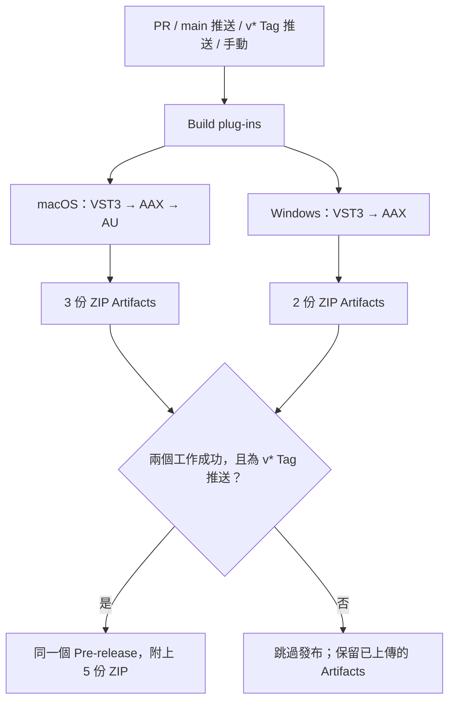

# JS Inflator — Hikari AAX 改作版

以 [JS Inflator](https://github.com/Kiriki-liszt/JS_Inflator) 為基礎，加入 AAX 整合與 macOS／Windows 建置的音訊效果器。**此 AAX 改作版本目前仍在測試中。** AAX 下載檔需搭配已取得授權的 **Pro Tools Developer**；尚未經 Avid/PACE 簽章，無法在標準版 Pro Tools 載入。

[English](README.md) · [繁體中文](README.zh-TW.md) · [下載](#downloads) · [安裝](#installation) · [架構](#architecture) · [GitHub Actions](#github-actions)


<a id="downloads"></a>
## 下載與平台版本

目前提供 **[v2.0.3.2-hikari-beta.2](https://github.com/Hikari-Tsai/JS_Inflator/releases/tag/v2.0.3.2-hikari-beta.2)** 預發行版。外掛內部版本仍為 `2.0.3.2`，Hikari 後綴用來識別此改作版的發布版本。[查看所有版本](https://github.com/Hikari-Tsai/JS_Inflator/releases)。

| 作業系統／CPU | 提供格式 | 相容性範圍 |
|---|---|---|
| macOS，Intel `x86_64` | VST3、AUv2、AAX | 建置目標為 macOS 10.13 起；宿主可能要求更新的 macOS |
| macOS，Apple Silicon `arm64` | VST3、AUv2、AAX | macOS 11 起；宿主可能要求更新的 macOS |
| Windows 10／11，`x64` | VST3、AAX | 64 位元宿主；Windows 宿主實測仍待完成 |

macOS ZIP 為 **Universal**，同一份下載同時包含 Intel 與 Apple Silicon 二進位，不必分開選。Windows ZIP 為 x64；目前沒有原生 Windows ARM64、32 位元或 Linux 發布套件。建置最低版本不代表每種作業系統與宿主組合都已實測。

| 平台 | 格式／適用宿主 | 下載 |
|---|---|---|
| macOS | VST3 — 支援 VST3 的 DAW | [](https://github.com/Hikari-Tsai/JS_Inflator/releases/download/v2.0.3.2-hikari-beta.2/JS_Inflator-macOS-VST3.zip) |
| macOS | AUv2 — Logic Pro、GarageBand 等 AU 宿主 | [](https://github.com/Hikari-Tsai/JS_Inflator/releases/download/v2.0.3.2-hikari-beta.2/JS_Inflator-macOS-AU.zip) |
| macOS | AAX — **僅限 Pro Tools Developer** | [](https://github.com/Hikari-Tsai/JS_Inflator/releases/download/v2.0.3.2-hikari-beta.2/JS_Inflator-macOS-AAX.zip) |
| Windows x64 | VST3 — 支援 VST3 的 64 位元 DAW | [](https://github.com/Hikari-Tsai/JS_Inflator/releases/download/v2.0.3.2-hikari-beta.2/JS_Inflator-Windows-VST3.zip) |
| Windows x64 | AAX — **僅限 Pro Tools Developer** | [](https://github.com/Hikari-Tsai/JS_Inflator/releases/download/v2.0.3.2-hikari-beta.2/JS_Inflator-Windows-AAX.zip) |

選擇宿主支援的格式即可，不必全部安裝。GitHub 自動產生的 **Source code** 壓縮檔是原始碼，不是可直接使用的外掛。AAX 提供 Native／AudioSuite target，不支援 AAX DSP；AudioSuite 功能尚未驗證。

<a id="installation"></a>
## 安裝方法

### macOS

1. 關閉 DAW，解壓縮所需格式的 ZIP。
2. 在 Finder 選擇「**前往 → 前往檔案夾⋯**」，開啟下表目的地，將解壓後的完整 bundle 複製進去；系統可能要求管理員密碼。
3. 重啟 DAW，必要時重新掃描外掛，再於音軌或 bus 插入 **JS Inflator**。AU 可能列在製造商 **yg331** 下。

| 要複製的 bundle | 目的資料夾 |
|---|---|
| `JS_Inflator.vst3` | `/Library/Audio/Plug-Ins/VST3/` |
| `JS_Inflator.component` | `/Library/Audio/Plug-Ins/Components/` |
| `JS_Inflator.aaxplugin` | `/Library/Application Support/Avid/Audio/Plug-Ins/` |

AU 下載檔已在 `.component` 內嵌入 VST3 實作，**不需另外安裝 VST3**，請保留整個 bundle。macOS 成品採 ad-hoc 簽章，尚未 notarize；若被 macOS 攔截，回報問題時請附上完整錯誤訊息。重新簽章無法取代標準版 Pro Tools 要求的 PACE 授權。

### Windows

1. 關閉 DAW，解壓縮 Windows ZIP。
2. 將整個 `.vst3` 或 `.aaxplugin` **資料夾**，連同其中的 `Contents`，複製到下表目的地；可能需要管理員權限。
3. 重啟 64 位元 DAW，必要時重新掃描外掛，插入 **JS Inflator**。AAX 請使用已取得授權的 Pro Tools Developer。

| 要複製的資料夾 | 目的資料夾 |
|---|---|
| `JS_Inflator.vst3` | `C:\Program Files\Common Files\VST3\` |
| `JS_Inflator.aaxplugin` | `C:\Program Files\Common Files\Avid\Audio\Plug-Ins\` |

不要只複製 `Contents/x86_64-win/` 或 `Contents/x64/` 內最深層的二進位檔。下載提供的是完整外掛 bundle，不是安裝程式；Windows 二進位尚未簽章。

安裝位置依據 [Steinberg VST3 文件](https://steinbergmedia.github.io/vst3_dev_portal/pages/Technical%2BDocumentation/Locations%2BFormat/Plugin%2BLocations.html)、[Apple AU 文件](https://support.apple.com/en-ie/102239)及 [Avid AAX 文件](https://learn-cdn.avid.com/AAX_SDK_2p1p1/Documentation/Doxygen/output/html/a00274.html)。

### 更新與問題排查

替換 beta 版本前，先備份舊外掛與重要 session，並用測試專案確認新版。移除時先關閉宿主，再刪除已安裝的 bundle。

- **宿主找不到外掛：** 確認作業系統／格式、安裝路徑、bundle 是否完整，以及宿主的掃描結果。標準版 Pro Tools 會拒絕這些尚未經 PACE 簽章的 AAX。
- **介面能開，但電表沒有動：** 確認音軌／bus 有音訊輸入，檢查宿主路由、播放狀態與 bypass。這是效果器，不會自行產生聲音。
- **旋鈕似乎無效：** `Effect = 0` 時，`Curve` 不會改變音訊；`OS = 1x` 時，`Phase` 不會改變音訊。

請在 [Issues](https://github.com/Hikari-Tsai/JS_Inflator/issues) 附上版本 Tag、作業系統版本、CPU、宿主與版本、外掛格式、取樣率及重現步驟。

<a id="architecture"></a>
## 系統架構與功能

核心採用 **C++ + Steinberg VST3 SDK + VSTGUI**，透過 Steinberg wrapper 將同一套核心整合為 AUv2 與 AAX；r8brain-free-src 負責線性相位取樣率轉換。CI 僅從 JUCE repository 取得 Avid SDK，外掛本身並非以 JUCE 框架開發。架構圖下方以 macOS 建置路徑為例，目前 CI 也同時建置 Windows VST3 與 AAX。

- Input／Output 增益、Effect、Curve、Clip、Split 與 bypass 控制。
- 1x、2x、4x、8x oversampling 與可切換的相位處理。
- 雙精度內部音訊處理，以及輸入／輸出／效果電表。
- Original 與 Twarch 兩套介面，支援換膚及縮放。

## 測試狀態

| 範圍 | 驗證依據／限制 |
|---|---|
| macOS＋Windows 建置與打包 | [五格式驗證紀錄](https://github.com/Hikari-Tsai/JS_Inflator/actions/runs/35078130661)，已檢查封裝結構及架構 |
| macOS AAX 控制與介面 | Pro Tools Developer 2025.6／Apple Silicon，在測試紀錄所列的本地 build 驗證旋鈕、電表、換膚與縮放 |
| Processor 與 UI 回歸測試 | 96 項音訊案例，以及電表傳遞、editor 整合檢查；見[測試紀錄](tests/results/aax-verification.md) |
| 尚待完成 | Windows 宿主實測、automation 錄製、session 儲存／重開，以及 AudioSuite 功能驗證 |

以上為不同層次的檢查，不代表每份 Release ZIP 都已在每個宿主人工測試。回歸測試執行方式見 [tests/README.md](tests/README.md)。AAX 仍屬實驗版本。

## 從原始碼建置

```bash
git clone --recurse-submodules https://github.com/Hikari-Tsai/JS_Inflator.git
cd JS_Inflator
```

使用 CMake 3.19 以上，工具鏈與 SDK revision 依 [macOS workflow](.github/workflows/macOS%20Build.yml) 或 [Windows workflow](.github/workflows/Windows%20Build.yml) 的固定版本設定。這兩份檔案包含發布成品使用的依賴下載、CMake 設定、編譯、驗證及打包指令。

| CMake target | 產物 |
|---|---|
| `JS_Inflator` | VST3 |
| `JS_Inflator-au` | macOS AUv2；需要 Xcode、AudioUnitSDK 與 `SMTG_ENABLE_AUV2_BUILDS=ON` |
| `JS_Inflator-aax` | AAX；需要有效的 `SMTG_AAX_SDK_PATH` 與 VSTGUI |

完成 configure 後，執行 `cmake --build <build-directory> --config Release --target <target>`。本地 AU 若要提供其他電腦安裝，也要執行 workflow 的 VST3 內嵌與重新簽章步驟，不能只保留 SDK 建立的開發捷徑。Bundle 版本在 `CMakeLists.txt` 修改，推送不同名稱的 Git Tag 不會自動改變它。

## GitHub Actions

統一入口 **Build plug-ins** 並行建置 macOS 與 Windows，產生五份 ZIP。PR 更新及推送至 `main` 會自動建置；沒有 PR 的一般 `staging` 推送不會觸發。手動建置只上傳 Artifacts；推送新的 `v*` Tag 時，兩個平台都成功才建立同一個 **Pre-release**，且不標示 Latest。

[Actions 與建置產物](https://github.com/Hikari-Tsai/JS_Inflator/actions) · [Release 下載](https://github.com/Hikari-Tsai/JS_Inflator/releases)

<details>
<summary>完整工作流說明：觸發條件、SDK、Artifacts、發布規則、CLI 與 PR Agent</summary>

### Workflow 分工與檔案對照

實際行為以 [`.github/workflows`](.github/workflows) 內的 YAML 為準。Actions 顯示名稱與檔名不完全相同：

| Actions 顯示名稱 | Workflow 檔案 | 負責工作 |
|---|---|---|
| **Build plug-ins** | [Mac Build.yml](.github/workflows/Mac%20Build.yml) | 統一入口：並行呼叫兩個平台，僅在版本 Tag 推送時發布 |
| **Mac Build** | [macOS Build.yml](.github/workflows/macOS%20Build.yml) | 可重用或單獨手動執行的 macOS 建置：VST3、AUv2、AAX |
| **Windows Build** | [Windows Build.yml](.github/workflows/Windows%20Build.yml) | 可重用或單獨手動執行的 Windows x64 建置：VST3、AAX |
| **PR Agent** | [pr-agent.yml](.github/workflows/pr-agent.yml) | AI 輔助 PR 描述與審查，獨立於編譯及發布工作 |

統一入口保留歷史檔名 `Mac Build.yml`，現在會建置**兩個平台**。每個平台內的格式依序編譯，兩個平台工作則獨立並行，實際開始時間取決於 runner 是否可用。AU 是 Apple 平台格式，本專案沒有 Windows AU 建置。

### 什麼情況會觸發？

| 事件 | Build plug-ins | 發布 Release | PR Agent workflow |
|---|---|---|---|
| 推送 commit 至 `main` | 兩個平台 | 否 | 否，除非另有 PR 事件 |
| 推送至 `staging` 或其他非 main 分支，沒有 PR | 不執行 | 否 | 不執行 |
| 開啟、重新開啟 PR，或向既有 PR 推送新 commit | 兩個平台 | 否 | 觸發；Bot 發送者跳過 |
| 將草稿 PR 改為 ready for review | 此事件本身不觸發 | 否 | 觸發；Bot 發送者跳過 |
| 推送符合 `v*` 的 Tag | 兩個平台 | 兩個平台成功後發布 | 不執行 |
| 手動執行 **Build plug-ins** | 兩個平台 | 否，即使選擇 Tag 也不發布 | 不執行 |
| 手動執行 **Mac Build**／**Windows Build** | 僅所選平台 | 否 | 不執行 |

目前沒有路徑篩選或 PR 目標分支篩選，因此只改 README 的 PR 也會建置，目標為 `staging` 的 PR 也適用。`pull_request` 建置通常使用 GitHub 產生的暫時合併 commit，不只是來源分支最後一筆 commit；Artifact 名稱中的 SHA 也對應這個 revision。PR 建置預設事件為 `opened`、`synchronize`、`reopened`，詳見 [GitHub 事件文件](https://docs.github.com/en/actions/reference/workflows-and-actions/events-that-trigger-workflows)。

所以，`staging` 有開啟中的 PR 時，推送可以透過 PR 更新事件觸發建置。合併至 `main` 後，則另起一次 main 分支建置。發布 job 不依賴 PR Agent 成功。目前未設定排程或 `issue_comment` 觸發。



### 建置環境與依賴

| 平台 | Runner | 建置工具與設定 | 二進位架構 |
|---|---|---|---|
| macOS | `macos-15` | CMake → Xcode 16.2，`Release` | Universal `x86_64` + `arm64` |
| Windows | `windows-2022` | CMake → Visual Studio 17 2022，PowerShell，`Release` | `x64` |
| 僅發布工作 | `ubuntu-latest` | 下載 Artifacts，再執行 GitHub CLI | 不編譯外掛 |

兩個平台都會 checkout 本 repository 與 recursive submodules，包括 `r8brain-free-src`。SDK 固定使用：

| 依賴 | Revision | 用途 |
|---|---|---|
| Steinberg VST3 SDK | `v3.7.12_build_20` | 兩個平台；包含 VSTGUI 與 AAX／AU wrapper |
| Apple AudioUnitSDK | `e789bc83ddc07cbf80e7bfaf84f1ade975287400`（1.3.0） | macOS AUv2 |
| JUCE repository 中的 Avid AAX SDK | `72782788ce18c2d4d760b28e0921d6ffc6431102`（SDK 2.9.0） | 兩個平台的 AAX |

AAX 僅 checkout `modules/juce_audio_plugin_client/AAX/SDK`，並檢查 `LICENSE.txt` 與版本常數 `20209000`。使用的是 Avid SDK 的 GPLv3 授權選項，**沒有連結 JUCE 模組**，也不需要私人 SDK repository 或 SDK token。AudioUnitSDK 1.3.0 配合專案既有的 AU 相容性要求。

工作流使用 `actions/checkout@v4`、`actions/upload-artifact@v4`、`actions/download-artifact@v4`；macOS 另使用 `maxim-lobanov/setup-xcode@v1`。這些 Action 版本標籤與 runner 映像仍可能收到上游更新，因此固定 SDK 版本不代表整個環境能逐位元重現。

### 每個平台實際檢查與打包什麼？

**macOS：** CMake 開啟 VSTGUI、AAX、AUv2，依序編譯 `JS_Inflator`、`JS_Inflator-aax`、`JS_Inflator-au`。每種格式的主要二進位都以 `lipo` 檢查 Intel 與 Apple Silicon 架構。VST3 驗證既有簽章；AAX 加上 ad-hoc 簽章後驗證。AU 打包會將 `Contents/Resources/plugin.vst3` 的外部開發用捷徑換成完整、已簽章的 VST3 bundle，再簽署外層 AU，以 `codesign --verify --deep --strict` 驗證，讓 AU 可獨立安裝。最後使用 `ditto` 製作 ZIP，保留 bundle 結構與執行權限。

**Windows：** 開啟 `SMTG_CREATE_BUNDLE_FOR_WINDOWS`、關閉安裝用連結，再編譯 `JS_Inflator` 與 `JS_Inflator-aax`。打包前檢查預期 bundle 路徑內有實際二進位，並驗證 DOS 標頭、PE signature 與 x64 machine type。PowerShell `Compress-Archive` 將完整 bundle 打包；Windows 成品未簽章。

VST3 SDK 在 validator target 可用時，也能於 post-build 階段執行 validator，實際結果請查建置紀錄。這些 workflow **沒有明確執行** `auval`、repository 的 96 項 processor 回歸測試、Pro Tools GUI 測試、session 儲存／重開測試或 AudioSuite 功能測試。先前的本地及人工驗證另見[測試紀錄](tests/results/aax-verification.md)。

兩個平台的 AAX 成品都需要 **Pro Tools Developer**。ad-hoc 簽章不是 Avid/PACE 簽章；這套流程不執行 PACE 簽章或 Apple notarization。CI 成功表示通過既定的建置／打包檢查，不等於完整宿主相容性驗證。

### 成品位置與下載方式

下表路徑相對於 runner 的暫時 checkout 目錄。上傳前，各 ZIP 直接存於 `build-macos/` 或 `build-windows/`。

| 格式 | Runner 內的 bundle 路徑 | 上傳 ZIP／Release asset |
|---|---|---|
| macOS VST3 | `build-macos/VST3/Release/JS_Inflator.vst3` | `JS_Inflator-macOS-VST3.zip` |
| macOS AUv2 | `build-macos/VST3/Release/JS_Inflator.component` | `JS_Inflator-macOS-AU.zip` |
| macOS AAX | `build-macos/AAXPLUGIN/Release/JS_Inflator.aaxplugin` | `JS_Inflator-macOS-AAX.zip` |
| Windows VST3 | `build-windows/VST3/Release/JS_Inflator.vst3` | `JS_Inflator-Windows-VST3.zip` |
| Windows AAX | `build-windows/AAXPLUGIN/Release/JS_Inflator.aaxplugin` | `JS_Inflator-Windows-AAX.zip` |

Windows 二進位位於 `JS_Inflator.vst3/Contents/x86_64-win/JS_Inflator.vst3` 與 `JS_Inflator.aaxplugin/Contents/x64/JS_Inflator.aaxplugin`。安裝時應複製整個 bundle，不是只拿最內層的二進位檔。

**Artifacts** 是附在單次 Actions 執行上的檔案，名稱為 `JS_Inflator-<platform>-<format>-<github.sha>`，內含上述 ZIP。到 [Actions](https://github.com/Hikari-Tsai/JS_Inflator/actions) → 點選一次執行 → **Artifacts** 下載。GitHub 網頁下載需要登入及 repository 讀取權限；下載封裝內可能還有外掛 ZIP，因此需要再解壓一次。workflow 未設定 `retention-days`，保留期限依 repository／organization 設定，詳見 [GitHub Artifact 下載文件](https://docs.github.com/en/actions/how-tos/manage-workflow-runs/download-workflow-artifacts)。

**Release assets** 則是將同一次建置的相同 ZIP，從 Artifacts 複製到[版本發布頁](https://github.com/Hikari-Tsai/JS_Inflator/releases)，不會隨 Actions Artifact 到期而一起消失。兩者都不會自動將外掛安裝到你的電腦。本地與 CI 使用相同專案原始碼及 target，但 SDK、工具鏈、編譯選項、簽章與打包方式也要一致，才能期待相近結果；不保證二進位檔案逐位元相同。

### Release 的條件與失敗處理

發布 job 設定 `needs: [macos, windows]`，且只有 `github.event_name == 'push'`、`github.ref` 以 `refs/tags/v` 開頭時才執行。它從**同一次 workflow run** 下載符合 `JS_Inflator-*-${{ github.sha }}` 的 Artifacts，合併到 `dist/`，再確認五份預期 ZIP 都存在且不是空檔。

接著以 `gh release create` 上傳五份檔案，使用 `--verify-tag --prerelease --latest=false`，依 Tag 產生標題。Release notes 包含平台、簽章限制，以及指向建置 SHA 的原始碼與測試紀錄連結；這份說明由 workflow 產生，不是 PR Agent 產生。

- 任一平台工作失敗或取消，就不發布。先前成功的上傳步驟仍可能留下部分 Artifacts，不能只看到有檔案就認定整次建置成功。
- 上傳來源不存在會讓 upload 步驟失敗；發布階段若缺 ZIP 或檔案為空，腳本會在執行 `gh release create` 前停止。
- `--verify-tag` 會拒絕不存在的 Tag。同名 Tag 已有 Release 時，不會更新或覆寫，而是建立失敗。若發布途中出現網路／上傳錯誤，可能已留下部分建立的 Release，重跑前先檢查發布頁。
- 同一 Tag 使用 `plugin-release-${{ github.ref }}` concurrency group，避免兩個發布工作同時進行；`cancel-in-progress: false` 會保留正在執行的發布工作。這不代表會自動去重或更新既有 Release。
- 目前所有符合 `v*` 的 Tag 都發布成 **Pre-release**，即使名稱沒有 `beta` 也一樣；不標示 **Latest**，也不會自動升級成正式發布。
- Tag 選定的是原始碼 revision，不會移動 `main`／`staging`，也不會自動修改 `CMakeLists.txt` 內的版本號。Tag 指向的 commit 必須包含統一入口與兩個可重用 workflow。

### 手動建置與發布操作

到 [Actions](https://github.com/Hikari-Tsai/JS_Inflator/actions)，選擇 **Build plug-ins** → **Run workflow** → 選擇如 `staging` 的分支。只建置單一平台則選 **Mac Build** 或 **Windows Build**。手動觸發需要 workflow 存在於預設分支；新增的 workflow 尚未合併到預設分支前，網頁入口可能不會出現。

在此 repository 目錄中完成 `gh auth login` 後，也可用 GitHub CLI：

```bash
# 兩個平台；這裡刻意使用保留的歷史檔名。
gh workflow run 'Mac Build.yml' --ref staging

# 僅單一平台。
gh workflow run 'macOS Build.yml' --ref staging
gh workflow run 'Windows Build.yml' --ref staging

# 將 RUN_ID 換成實際執行編號。
gh run list --branch staging
gh run view RUN_ID --log-failed
gh run download RUN_ID --dir downloaded-artifacts
```

要發布時，先 checkout 到要發布的 commit，確認 Tag 尚未使用。下例會標記目前的 `HEAD`，不代表這個版本已發布：

```bash
git tag -a v2.0.3.2-hikari-beta.3 -m "Hikari beta 3"
git push origin v2.0.3.2-hikari-beta.3
```

推送這個新 Tag 會啟動兩個平台，成功後發布五份 ZIP。只推送 `staging`、手動選 Tag 建置，或重跑非 Tag 的執行，都不會發布 Release。尚未發布的 Tag 若因暫時性問題失敗，可先確認發布頁是否已有 Release，再使用 **Re-run failed jobs**。若修改了原始碼或 workflow，則需要新 commit，通常也應使用新 Tag，重跑舊 revision 不會包含修正。

### PR Agent、權限與 Secrets

PR Agent 與 `Build plug-ins` 各自執行。workflow 訂閱 `opened`、`reopened`、`synchronize`、`ready_for_review`，事件發送者類型為 `Bot` 時跳過 review job。它在 `ubuntu-latest` 執行 `the-pr-agent/pr-agent@main`；每個 PR 使用 `pr-agent-<number>` concurrency group，有新執行時取消舊的進行中審查。

workflow 指定自動產生描述與審查（`auto_describe: true`、`auto_review: true`），並設定 `auto_improve: false`。**目前有一處設定不一致：** [`.pr_agent.toml`](.pr_agent.toml) 同時設定 `auto_improve = true`。這是兩處實際設定值，不能因此保證程式碼建議已停用；請依該次 Action 使用版本的解析結果 `auto_improve` 與執行紀錄判定。上游使用 `@main`，其實作可能獨立更新；workflow 被觸發不代表每個審查工具都一定執行。

repository 設定要求模型 `gpt-5.5-2026-04-23`、fallback `gpt-5.4-mini`、繁體中文（`zh-TW`）回覆。審查至多五項發現，使用持續更新的評論，重點包含正確性、回歸、測試／安全／修改難度、即時音訊執行緒安全、參數／狀態／聲道／延遲相容性，以及 SDK 與 macOS 相容性。PR 描述不發布 labels、不產生圖，保留使用者原始描述；ignore patterns 排除建置目錄、`vst3sdk/**` 與 `AudioUnitSDK/**`。Action 行為可參考[上游自動化文件](https://github.com/the-pr-agent/pr-agent/blob/main/docs/docs/usage-guide/automations_and_usage.md)。

| 工作 | Token 權限／Secrets |
|---|---|
| 平台建置 | 內建 `GITHUB_TOKEN`，`contents: read`；不需私人 SDK secret |
| Release | 內建 token 以 `GH_TOKEN` 傳入，僅發布 job 使用 `contents: write`；不需另建 PAT |
| PR Agent | 內建 `GITHUB_TOKEN`，`contents: read`、`issues: write`、`pull-requests: write`；另需 repository secret `OPENAI_KEY` |

`OPENAI_KEY` 設於 **Settings → Secrets and variables → Actions**，建置工作不使用這個 key。Fork PR 可能需要核准執行 Actions，通常不會取得 repository secrets，且 token 為唯讀，因此公開 SDK 的建置可用時，PR Agent 仍可能無法驗證身分或寫入審查。PR Agent 失敗不等於編譯失敗；看到紅色檢查時，應先開啟對應 workflow／job，查出失敗步驟再重跑。
</details>

## 授權與致謝

本改作版與 JS Inflator 採 **GNU GPLv3**，詳見 [LICENSE](LICENSE)。散布二進位或修改版本時，須保留必要聲明，並依 GPLv3 提供對應原始碼與建置材料。依賴套件保有各自授權：r8brain-free-src（MIT）、VSTGUI（BSD 3-Clause）、AudioUnitSDK（Apache 2.0），以及固定版本 Steinberg／Avid SDK 適用的 GPLv3／商業或個別檔案條款。SDK 授權、Pro Tools 使用授權及 PACE 簽章是不同事項。

基於 [yg331／Kiriki-liszt 的 JS Inflator](https://github.com/Kiriki-liszt/JS_Inflator)，替代介面由 **Twarch** 製作，取樣率轉換使用 [Aleksey Vaneev 的 r8brain-free-src](https://github.com/avaneev/r8brain-free-src)。此 repository 維護 Hikari AAX 改作與跨平台建置整合。
