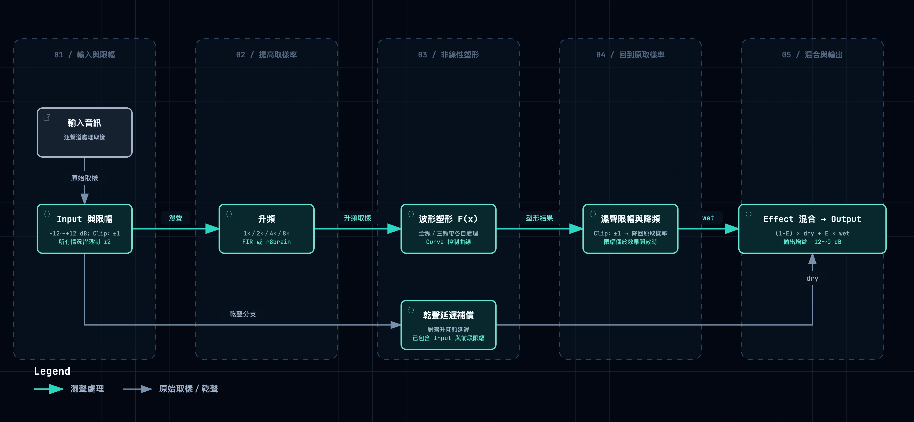

# 音訊演算法

JS Inflator 使用**逐取樣波形塑形**：透過非線性曲線改變每個取樣的振幅，讓中小振幅相對峰值提高，增加訊號密度，同時產生諧波。塑形函式沒有 attack／release 包絡控制；PPM 電表只觀察訊號，不回授控制塑形。以下說明依據 JSIF 開源實作，不代表已驗證 Sonnox 的內部演算法。



- **Input 與 Clip：** Input 提供 −12～+12 dB 增益。Clip 開啟時，在升頻前將取樣限制於 ±1；此位置在所有情況下都有 ±2 上限。乾聲分支取自這些操作之後。
- **濕聲處理：** 以 1×、2×、4× 或 8× 升頻，套用 Curve 控制的塑形曲線，依 Clip 設定限制於 ±1，再降回原取樣率。超取樣使用自製 FIR 或 r8brain 路徑減少混疊，代價是 CPU 用量與延遲。關閉 Effect In 會跳過塑形與濕聲限幅，仍保留升降頻。
- **Band Split：** 開啟後，以 240 Hz 與 2400 Hz 濾波器產生重疊的低、中、高頻帶，各自塑形，再以 `F(L) + F(G*M)/G + F(H)` 相加，其中 `G` 為中頻增益補償。
- **Effect 與 Output：** 乾聲先延遲至與濕聲對齊，再以 `(1−E)*dry + E*wet` 混合，其中 `E = Effect / 100`，最後套用 −12～0 dB 的 Output 增益。**Effect = 0% 不等於完整 bypass：** Input 與前段限幅仍有效；主機 Bypass 另走延遲補償路徑。

<details>
<summary>塑形公式與過載行為</summary>

令 `a = abs(x)`，`c = Curve / 100`，其中 Curve 為介面顯示的 −50～+50。定義 `D = 0.0625 − 0.25*c + 0.25*c²`：

```text
0 ≤ a ≤ 1: F(a) = (1.5+c)*a − 2*c*a² + (c−0.5)*a³ − D*a²*(1−a)²
1 < a < 2: F(a) = 2*a − a²
    a ≥ 2: F(a) = 0

y = sign(x) * F(abs(x))
```

Curve = 0 時，振幅 0.5 會變成約 0.6836，而 1 維持為 1。振幅超過 1 後，濕聲塑形輸出會折返：1.5 變成 0.75，2 變成 0。因此 Input 越大，不一定代表濕聲越響。Clip 也不保證最終輸出受到 true peak 限制。

</details>

程式碼依據：[塑形與處理流程](../source/JSIF_processor.cpp)（`process_inflator`、`processAudio`）及[分頻係數](../source/JSIF_processor.h)（`Band_Split_set`）。AAX 與 VST3 共用這套處理核心。

[← 返回 README](../README.zh-TW.md)
